# GraphQL schema embedder MCP server

Python MCP server for LLMs that indexes a GraphQL schema, stores embeddings per `type->field` via an embeddings endpoint, and enables fast lookup plus `run_query` execution once relevant types are identified to fetch data from your GraphQL endpoint.

## Architecture
- GraphQL schema: provide a schema file (SDL) to exercise parsing and indexing.
- Indexer: `schema_indexer.py` flattens the schema into `type.field` signatures (with arguments and return types), embeds each summary via the configured embeddings endpoint, and persists to `data/metadata.json` + `data/vectors.npz` (normalized embeddings for cosine search).
- Server: `server.py` exposes MCP tools `list_types` and `run_query`. The server ensures the schema index exists on startup; it only calls the embeddings endpoint when reindexing or embedding a new query.
- Persistence: `data/` is `.gitignore`'d so you can regenerate locally without polluting the repo.



## Setup
Set env vars. You can start from `.env.example`.

Environment configuration:
- `GRAPHQL_EMBED_API_KEY` (or `OPENAI_API_KEY`)
- `GRAPHQL_EMBEDDINGS_URL` (full embeddings URL)
- `GRAPHQL_EMBED_MODEL`
- `GRAPHQL_EMBED_API_KEY_HEADER` / `GRAPHQL_EMBED_API_KEY_PREFIX`
- `GRAPHQL_EMBED_HEADERS` (JSON object string for extra headers)
Endpoint auth (when using `GRAPHQL_ENDPOINT_URL`):
- `GRAPHQL_ENDPOINT_HEADERS` (JSON object string, merged with any `--header` flags)

```bash
python3 -m venv .venv
source .venv/bin/activate
pip install -r requirements.txt
python3 src/server.py
```

## Run the MCP server
```bash
python3 src/server.py                # SSE on 127.0.0.1:8000/sse by default
python3 src/server.py --transport sse     # explicit SSE
python3 src/server.py --transport streamable-http  # Streamable HTTP on 127.0.0.1:8000/mcp
# Or: point at a live GraphQL endpoint (requires introspection enabled)
python3 src/server.py --endpoint https://api.example.com/graphql
# Endpoint auth headers (repeat --header)
python3 src/src/server.py --endpoint https://api.example.com/graphql --header "Authorization: Bearer $TOKEN"
# Options: --host 0.0.0.0 --port 9000 --log-level DEBUG --mount-path /myapp
```
Tools:
- `list_types(query, limit=5)` – fuzzy search over `type.field` signatures (embeddings; auto-build index if missing). Results are ordered with `Query` fields first and include a `query_template` for `Query` fields plus a `selection_hint` for object fields.
- `run_query(query)` – if `--endpoint` is set, proxies the query to the endpoint; otherwise validates/runs against the local schema (no resolvers; primarily for validation/shape checking, data resolves to null).
Both indexing and querying use the same embedding model (`text-embedding-3-small` by default, override via config/env or `--model`).

Example `list_types` output:
```json
[
  {
    "type": "Query",
    "field": "users",
    "summary": "Query.users(limit: Int = 10, offset: Int = 0) -> [User!]!",
    "query_template": "query { users(limit: <Int = 10>, offset: <Int = 0>) { id name email profile { joinedAt preferences { newsletter } } orders { id status total } } }"
  },
  {
    "type": "User",
    "field": "orders",
    "summary": "User.orders -> [Order!]!",
    "selection_hint": "orders { id status total items { quantity subtotal } }"
  },
  {
    "type": "Product",
    "field": "reviews",
    "summary": "Product.reviews -> [Review!]!",
    "selection_hint": "reviews { id rating title author { id name } }"
  }
]
```

Notes:
- `python3 src/server.py` defaults to the `sse` transport; pass `--transport streamable-http` if you want HTTP instead.
- You can also set env vars prefixed with `FASTMCP_` (e.g., `FASTMCP_HOST`, `FASTMCP_PORT`, `FASTMCP_LOG_LEVEL`) to override defaults.
- The server exposes MCP `instructions` (override with `MCP_INSTRUCTIONS`) that describe the server as an abstraction layer and tell the LLM to use `list_types` then `run_query` with minimal tool calls.

## Quick test with the MCP Inspector
Requires `npm`/`npx` on PATH.

### Connect to an already-running SSE server
In one terminal (start the server):
```bash
python3 src/server.py --transport sse --port 8000
```
In another terminal (start the Inspector and point it at `/sse`):
```bash
npx @modelcontextprotocol/inspector --transport sse --server-url http://127.0.0.1:8000/sse
```

## Configure in Claude Desktop / CLI
If you're running this server locally over SSE (default), point Claude at the `/sse` URL.

```bash
claude mcp add --transport sse graphql-mcp http://127.0.0.1:8000/sse
```

You can also configure via JSON (e.g. config file):
```json
{
  "mcpServers": {
    "graphql-mcp": {
      "type": "sse",
      "url": "http://127.0.0.1:8000/sse"
    }
  }
}
```

If you expose this server behind auth, pass headers:
```bash
claude mcp add --transport sse private-graphql http://127.0.0.1:8000/sse \
  --header "Authorization: Bearer your-token-here"
```
